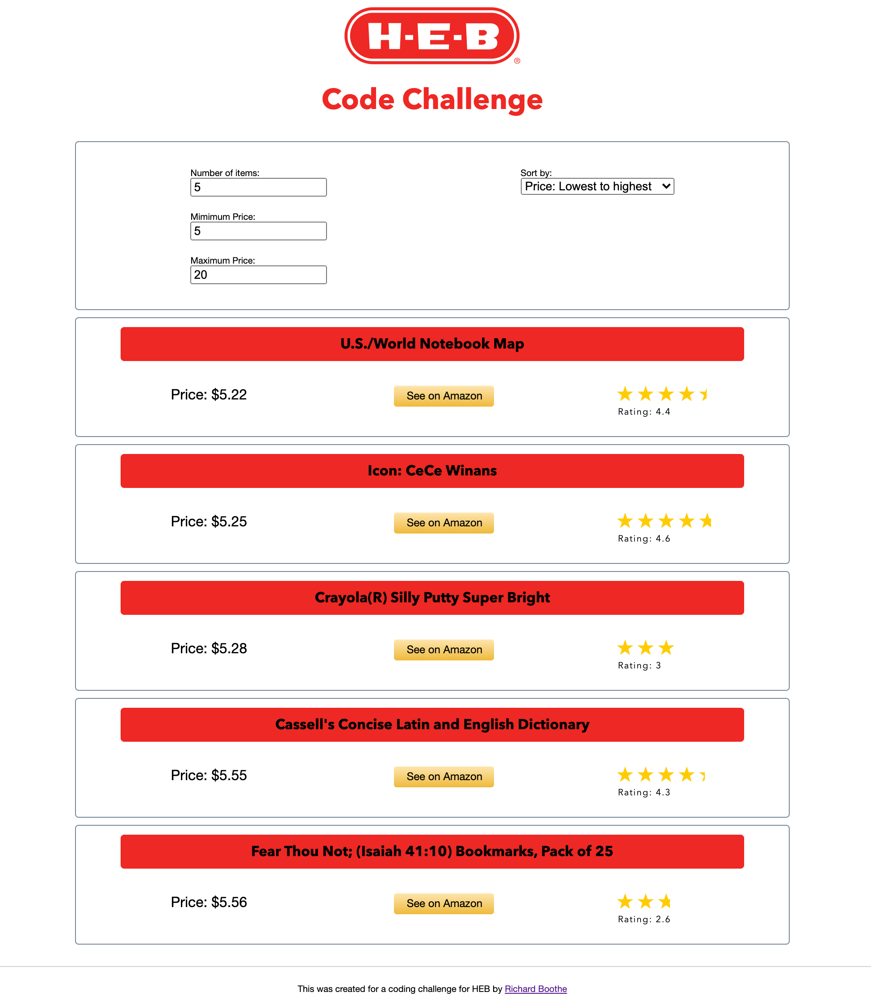

# HEB Coding Challenge

The following was a coding challenge I was tasked with for a software developer position at HEB. 

A similar version of this code can be found on [StackBlitz](https://stackblitz.com/edit/heb-code-challenge?file=src/App.js).

The task was to develop a UI that would perform the following:
1. Interface with a pre-existing API and fetch a collection of books
2. Filter out any books that were not between $5 and $20
3. Sort the books in ascending order (lowest to highest) in regard to price

These tasks were completed. However, I felt there was much to be desired before I placed the code on my github, so I added the following:
1. Dynamic filtering based on price minimums and maximums
2. Dynamic filtering based on the number of items shown
3. Dynamic sorting based on preferences of 
    - Price: Lowest to Highest
    - Price: Highest to Lowest
    - Rating: Lowest to Highest
    - Rating: Highest to Lowest

The tasks that I will implement next will be the following:
1. Implement testing through jest
2. Add statistics that will show the lowest and highest prices as well as the best rating
3. Make the rating more UI friendly (stars/half-stars)
4. Make UI mobile friendly

